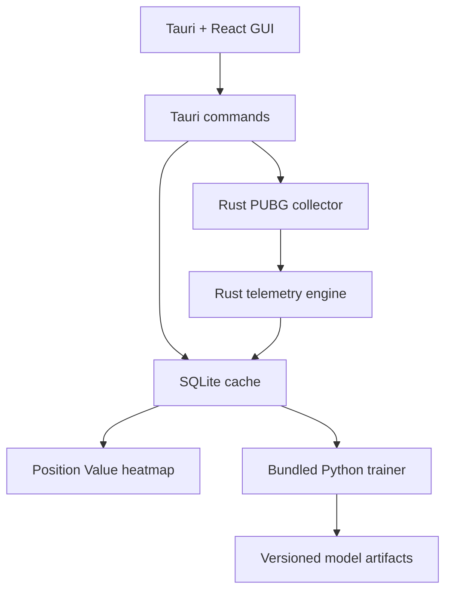

# PUBG Analyzer

PUBG 공식 API와 텔레메트리로 **“다음 원이 어디인가”가 아니라 “지금 어느 위치를 선점하는 것이 유리한가”**를 분석하는 Windows 데스크톱 앱입니다.

앱의 수집·파싱·통계·저장·GUI 백엔드는 Rust로 동작합니다. 모델 재학습만 격리된 Python sidecar가 담당하며, 배포 시 PyInstaller 실행 파일로 묶이므로 사용자가 Python을 설치할 필요는 없습니다.

## 현재 구현 범위

- 닉네임과 플랫폼을 이용한 PUBG 계정 조회
- 계정의 최근 매치 목록 자동 수집
- 매치 asset에서 공식 telemetry URL 추출 및 병렬 다운로드
- RPM 제한기와 PUBG 응답의 rate-limit 상태 추적
- 이미 분석한 매치 건너뛰기, 실패 매치 재시도, 작업 취소
- SQLite WAL 기반 로컬 영속화
- OS 자격 증명 저장소를 이용한 API 키 보관
- gzip/일반 JSON 텔레메트리 자동 판별
- 페이즈별 자기장, 팀 위치·분산·차량, 적 팀 밀도, 생존 label 추출
- 피해·다운·킬·사망의 공간 집계와 상대고도 proxy
- 여러 경기의 페이즈·공간 셀 통합 및 보수적으로 축소한 Position Value
- 공식 PUBG 지도 이미지 위에 표시하는 맵/페이즈별 SVG 히트맵과 셀 상세 지표
- Python sidecar 기반 다음 원 잔류·60초/120초 생존 모델 학습
- 매치 단위 holdout과 Brier Score·Log Loss·ROC AUC 기록

## 구조



| 계층 | 기술 | 책임 |
|---|---|---|
| GUI | Tauri 2, React, TypeScript | 설정, 진행률, 히트맵, 학습 UI |
| 앱 백엔드 | Rust | command 경계, 자격 증명, sidecar 관리 |
| 분석 코어 | Rust | API, telemetry 파싱, feature/점수 집계 |
| 저장소 | SQLite | 설정, 매치 상태, 원본 경로, 분석 결과 |
| 학습기 | Python, scikit-learn | 오프라인 학습과 평가만 담당 |

Python 분석기/API 서버는 제거했습니다. `trainer/`의 Python은 선택적 학습 작업만 수행하며 앱 프로세스와 격리됩니다.

## 개발 실행

필수 도구:

- Rust stable
- Node.js 24 이상
- Python 3.11 이상 — sidecar를 빌드하거나 학습기 테스트를 실행할 때만 필요
- 플랫폼별 [Tauri prerequisites](https://v2.tauri.app/start/prerequisites/)

```bash
npm install
npm run tauri:dev
```

브라우저에서 GUI 레이아웃만 확인하려면 다음 명령을 사용합니다. 브라우저 모드에서는 실제 API를 호출하지 않고 미리보기용 데이터가 표시됩니다.

```bash
npm run dev
```

## Windows EXE 빌드

```powershell
python -m pip install -r trainer/requirements.txt
npm install
npm run tauri:build -- --bundles nsis
```

빌드 과정은 현재 Rust target triple에 맞는 `pubg-trainer-<target>.exe`를 먼저 생성하고 Tauri external binary로 포함합니다. 최종 설치 파일은 보통 다음 위치에 생성됩니다.

```text
target/release/bundle/nsis/
```

## 앱 사용 순서

1. [PUBG Developer Portal](https://developer.pubg.com/)에서 API 키를 발급합니다.
2. 설정 화면에서 플레이어 이름, 플랫폼, API 키와 RPM을 저장합니다.
3. `최신 매치 동기화`를 누릅니다.
4. 앱이 새 매치의 메타데이터와 telemetry를 수집하고 Rust로 분석합니다.
5. 맵과 페이즈를 선택해 Position Value 히트맵을 확인합니다.
6. 충분한 경기가 쌓이면 모델 학습 화면에서 확률 모델을 재학습합니다.

API 키는 SQLite나 로그에 쓰지 않고 Windows Credential Manager/macOS Keychain/Linux Secret Service에 저장합니다. Telemetry URL도 `https://telemetry-cdn.pubg.com`만 허용합니다.

## Position Value 해석

`historicalValueScore`는 다음 관측값을 결합한 기술 통계입니다.

- 120초 생존율
- 다음 원 잔류율
- 평균 자리 유지 시간
- 다음 원 진입 부담
- 피해 교환 결과
- 주변 적 팀 경쟁도

표본이 적은 셀은 중립값인 50점 쪽으로 축소하며 `scoreConfidence`를 함께 표시합니다. 이 값은 아직 인과효과가 아니므로 “그 좌표가 팀을 강하게 만들었다”가 아니라 “비슷한 상황에서 그 좌표의 관측 결과가 좋았다”로 해석해야 합니다.

텔레메트리 좌표는 공식 스키마의 좌상단 `(0,0)` 기준을 그대로 사용합니다. 맵별 전체 좌표 범위에 지도 이미지를 맞춘 뒤 분석 셀을 동일한 좌표계로 겹치므로, 관측된 셀만 확대해서 실제 위치가 왜곡되지 않습니다. 지도 자산은 공식 [`pubg/api-assets`](https://github.com/pubg/api-assets)의 저해상도 이미지를 WebP로 변환해 포함했으며 자세한 출처는 `public/maps/ATTRIBUTION.md`에 기록했습니다.

학습 입력은 실제 미래 원 좌표와 미래 이동거리를 제외합니다. 미래 값은 label 생성에만 사용하고, 검증도 행을 무작위로 섞지 않고 매치 ID 단위로 분리합니다.

## 데이터 위치

Tauri의 OS별 app data 디렉터리에 다음 파일이 생성됩니다.

```text
pubg-analyzer.sqlite3       설정·매치·분석 결과
telemetry/*.json.gz         원본 보관을 켠 경우의 telemetry
training/training-rows.jsonl
models/*.joblib
models/manifest.json
```

## 검증

```bash
cargo fmt --all -- --check
cargo test -p pubg-analyzer-core
npm run build
PYTHONPATH=trainer python -m unittest discover -s trainer -p "test_*.py"
```

로컬 telemetry 파일을 Rust 분석기로 직접 점검할 수도 있습니다.

```bash
cargo run -p pubg-analyzer-core --example analyze_file -- telemetry.json.gz
```

`tests/fixtures/minimal_telemetry.json`은 Python 구현에서 사용하던 기준 fixture를 그대로 유지해 Rust 포팅의 회귀 테스트에 사용합니다.

## 제한 사항

- PUBG API가 계정 관계에 제공하는 최근 매치 범위 안에서만 자동 수집합니다.
- 맵의 정적 지형 mesh를 사용하지 않습니다. 위치 이동·체류·교전 결과와 관측 `z`를 지형 효과의 proxy로 사용합니다.
- 현재 점수는 historical baseline입니다. 팀 전력·도착 시각의 선택 편향 보정과 walk-forward calibration은 후속 모델 단계에서 강화해야 합니다.
- Windows 설치 파일이 기본 배포 대상입니다. macOS/Linux는 소스 빌드가 가능하지만 별도의 서명·패키징 설정이 필요합니다.
